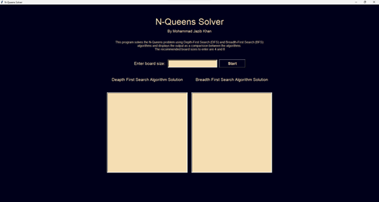
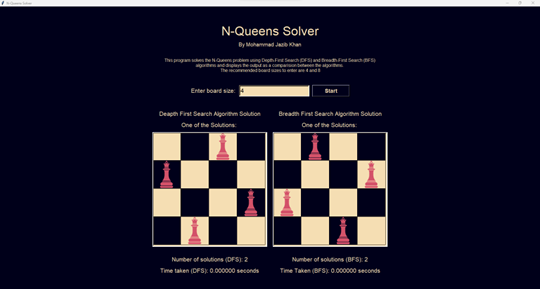
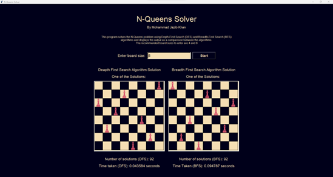

# N-Queens Solver with DFS and BFS

This program provides a graphical interface for solving the N-Queens problem using Depth-First Search (DFS) and Breadth-First Search (BFS) algorithms. The N-Queens problem is a classic algorithmic puzzle that involves placing N chess queens on an N×N chessboard so that no two queens threaten each other. This implementation offers a comparison between DFS and BFS solutions in terms of the number of solutions and the time taken to find them.

## Features

- **Graphical User Interface (GUI):** Built with Tkinter to provide an interactive experience.
- **Algorithm Comparison:** Solves the N-Queens problem using both DFS and BFS and compares the results.
- **Visualization:** Displays one of the possible solutions on a chessboard.
- **Performance Metrics:** Shows the number of solutions and the time taken by each algorithm.

## Prerequisites

- Python 3.x
- Tkinter (usually included with Python)
- Pillow (PIL) for image processing

You can install the Pillow library using pip:

```sh
pip install pillow
```

## How to Run

1. **Ensure you have the prerequisites installed.**
2. **Download the `queen.png` image and place it in the same directory as the script.** This image is used to represent the queens on the board.
3. **Run the script:**

```sh
python nqueens_solver.py
```

## Usage

1. **Start the Application:** Launch the application by running the script. A window titled "N-Queens Solver" will appear.
2. **Enter Board Size:** Input the size of the board (N) in the provided entry field.
3. **Start the Solver:** Click the "Start" button to begin solving the N-Queens problem.
4. **View Results:** The application will display one of the solutions found by DFS and BFS on separate canvases. It will also show the number of solutions and the time taken by each algorithm.

## Code Structure

- **NQueens Class:** Contains the core logic for solving the N-Queens problem using DFS and BFS.
  - `solve_dfs()`: Implements the DFS algorithm.
  - `solve_bfs()`: Implements the BFS algorithm.
  - `conflict()`: Checks for conflicts between queens.
- **main Function:** Sets up the GUI and handles user interactions.
  - `start_solver()`: Starts the solving process and updates the GUI with results.
  - `display_solution()`: Visualizes a solution on the chessboard.

## Example

Here is an example of the application's interface after solving an 8x8 board:

### N-Queens Solver Interface

#### The GUI of the Program:



#### N-Queens Solver with 4x4 board:



#### N-Queens Solver with 8x8 board:



The above images shows both the GUI and the comparison between DFS and BFS solutions, with the number of solutions and time taken by each algorithm. The chessboard displays one of the possible solutions for the given board size.

Feel free to reach out for any queries or suggestions.
